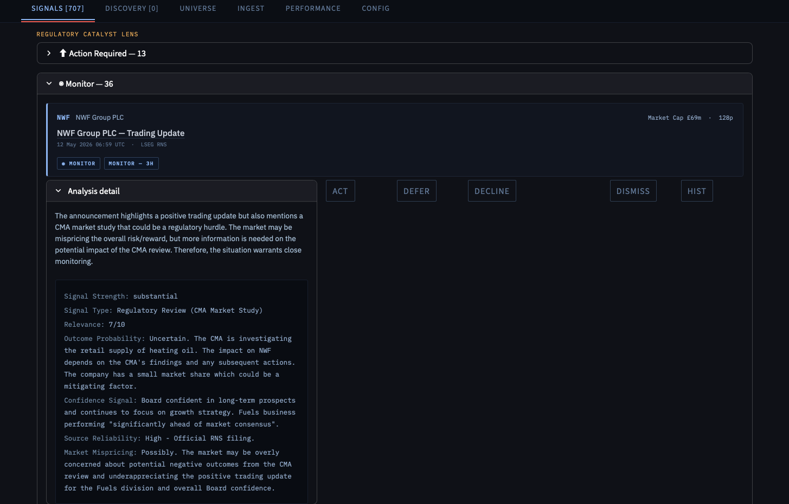

# stock-research

Autonomous signal detection for LSE small-cap investing, using multi-lens LLM analysis to find convergence between independent information sources.

---

**Disclaimer.** This is a personal research tool built for my own use. It is not investment advice, not a commercial product, and not a recommendation to buy or sell any security. Signal outputs reflect experimental pattern detection and carry no implied accuracy or suitability for any investment decision.

---

## What this is

A system that monitors regulatory announcements on the London Stock Exchange, classifies them by type, and runs each through independent analytical lenses to assess whether they represent meaningful catalyst opportunities in small-cap equities. When multiple lenses converge on the same ticker — a director buying shares while a regulatory approval lands — the signal is materially stronger than either alone. The system tracks signal state over time, manages decay, and delivers prioritised alerts via Telegram with a Streamlit interface for review and position management.

## Architecture

```mermaid
graph TD
    subgraph EXT_DATA["<b>External Data Sources</b>"]
        LSEG["LSEG RNS Feed"]
        YFINANCE["Yahoo Finance"]
    end

    subgraph EXT_API["<b>External APIs</b>"]
        ANTHROPIC["Anthropic API<br/><i>Claude Sonnet · Haiku</i>"]
        GSEARCH["Google Search<br/>Grounding"]
        GEMINI["Google Gemini API<br/><i>2.0 Flash</i>"]
    end

    subgraph LOCAL["<b>Local - WSL2 on residential hardware</b>"]
        direction TB

        SCRAPER["RNS Scraper<br/><i>Playwright · hourly 07:30-19:30</i>"]

        subgraph LOCAL_ORCH["Agentic Investigation<br/><i>hourly :50 · residential IP for yfinance</i>"]
            direction LR
            DIR_AGENTIC["Director Purchasing<br/>— Agentic<br/><i>Claude Haiku + Sonnet</i><br/>3 layers · 13 tools"]
            TR1_RESEARCH["TR-1 Investor<br/>Research<br/><i>Gemini + Search</i>"]
            SYNTHESIS["Agentic Synthesis<br/><i>Claude Sonnet</i>"]
        end

        INDEX_SNAP["Index Snapshot<br/><i>daily 17:00 UTC</i>"]
        PERF_SNAP["Signal Performance<br/><i>daily 18:00 UTC</i>"]
        STREAMLIT["Streamlit Interface<br/><i>Signal review · position management<br/>Ingest · Discovery · Universe · Config</i>"]
    end

    subgraph GCP["<b>GCP - europe-west2 - e2-micro VM</b>"]
        direction TB

        JOB_RUNNER["Job Runner<br/><i>systemd · polls every 10s</i>"]

        subgraph CLASSIFICATION["Classification"]
            CLASSIFIER["Article Classifier<br/><i>Claude Sonnet</i><br/>pdmr · tr1 · regulatory · admin"]
        end

        subgraph SIMPLE_LENSES["Simple Lenses — one-shot baseline"]
            direction LR
            REG["Regulatory<br/>Catalyst<br/><i>Gemini Flash</i>"]
            DIR_SIMPLE["Director Purchasing<br/>— Baseline<br/><i>Gemini Flash</i>"]
            TR1_SIMPLE["TR-1<br/>Accumulation<br/><i>Gemini Flash</i>"]
        end

        PROPOSAL["Proposal Agent<br/><i>Deterministic — no LLM</i><br/>Cross-lens disqualification<br/>Signal maturity · Compounding"]

        STATE["Signal State Machine<br/><i>Deterministic transitions</i><br/>watching / monitor / active / reinforced<br/>Time-based decay"]

        FIRESTORE[("Cloud Firestore<br/><i>Native mode</i><br/>signals_unified · universe<br/>signal_history · pending_jobs")]

        TELEGRAM["Telegram Notifier<br/><i>Two-tier ACT alerts</i>"]
    end

    subgraph EXT_DEST["<b>External Destinations</b>"]
        TG_USER["Telegram"]
    end

    %% ── Ingestion flow ──
    LSEG -- "GET · residential IP" --> SCRAPER
    SCRAPER -- "submits jobs" --> FIRESTORE
    YFINANCE -- "price data · residential IP" --> DIR_AGENTIC
    YFINANCE -- "price snapshots" --> INDEX_SNAP
    YFINANCE -- "return data" --> PERF_SNAP

    %% ── Job processing ──
    FIRESTORE -- "pending_jobs" --> JOB_RUNNER
    JOB_RUNNER -- "on new job" --> CLASSIFIER

    %% ── Classification → simple lenses (GCP) ──
    CLASSIFIER -- "regulatory" --> REG
    CLASSIFIER -- "pdmr" --> DIR_SIMPLE
    CLASSIFIER -- "tr1" --> TR1_SIMPLE

    %% ── Simple lens LLM calls ──
    CLASSIFIER -. "API call" .-> ANTHROPIC
    REG -. "API call" .-> GEMINI
    DIR_SIMPLE -. "API call" .-> GEMINI
    TR1_SIMPLE -. "API call" .-> GEMINI

    %% ── Simple lens persistence ──
    REG -- "on analysis" --> FIRESTORE
    DIR_SIMPLE -- "on analysis" --> FIRESTORE
    TR1_SIMPLE -- "on analysis" --> FIRESTORE

    %% ── Agentic investigation (local, claims pending signals from Firestore) ──
    FIRESTORE -- "pending agentic signals" --> DIR_AGENTIC
    FIRESTORE -- "pending agentic signals" --> TR1_RESEARCH
    DIR_AGENTIC -- "3 layer outputs" --> SYNTHESIS
    SYNTHESIS -- "enriched result" --> FIRESTORE
    TR1_RESEARCH -- "investor classification" --> FIRESTORE

    %% ── Agentic LLM calls ──
    DIR_AGENTIC -. "tool-use loop" .-> ANTHROPIC
    TR1_RESEARCH -. "investor lookup" .-> GSEARCH
    TR1_RESEARCH -. "API call" .-> GEMINI
    SYNTHESIS -. "API call" .-> ANTHROPIC

    %% ── Post-save enrichment ──
    FIRESTORE -- "on signal save" --> PROPOSAL
    PROPOSAL -- "enriched signal" --> FIRESTORE
    PROPOSAL -- "state transition" --> STATE
    STATE -- "append-only history" --> FIRESTORE

    %% ── Notifications ──
    PROPOSAL -- "act or reinforced" --> TELEGRAM
    TELEGRAM --> TG_USER

    %% ── Streamlit reads ──
    FIRESTORE -- "read-only queries" --> STREAMLIT

    %% ── Performance tracking ──
    INDEX_SNAP -- "index snapshots" --> FIRESTORE
    PERF_SNAP -- "price snapshots" --> FIRESTORE

    %% ── Styling ──
    classDef local fill:#dbeafe,stroke:#3b82f6,stroke-width:2px,color:#1e3a5f
    classDef gcp fill:#fef3c7,stroke:#d97706,stroke-width:2px,color:#78350f
    classDef ext fill:#f1f5f9,stroke:#94a3b8,stroke-width:1px,color:#475569
    classDef store fill:#fed7aa,stroke:#c2410c,stroke-width:2px,color:#7c2d12
    classDef lens fill:#d1fae5,stroke:#059669,stroke-width:1px,color:#064e3b
    classDef agentic fill:#ede9fe,stroke:#7c3aed,stroke-width:2px,color:#4c1d95

    class SCRAPER,INDEX_SNAP,PERF_SNAP,STREAMLIT local
    class JOB_RUNNER,CLASSIFIER,PROPOSAL,STATE,TELEGRAM gcp
    class REG,DIR_SIMPLE,TR1_SIMPLE lens
    class DIR_AGENTIC,TR1_RESEARCH,SYNTHESIS agentic
    class FIRESTORE store
    class LSEG,YFINANCE,ANTHROPIC,GEMINI,GSEARCH,TG_USER ext
```

### Deployment topology

The system runs across two locations by design. **Local (WSL2 on residential hardware)** hosts web-scraping ingestion, the agentic investigation layers, and the Streamlit interface. LSEG and Yahoo Finance reliably block or rate-limit requests from cloud IP ranges, and the agentic director lens requires yfinance price data for its 13-tool investigation — so anything that touches external data sources runs locally. Streamlit runs locally to avoid the access-control overhead of exposing it through GCP. **GCP (europe-west2, e2-micro)** hosts the always-on job runner, article classification, one-shot simple lenses, signal state management, and Telegram dispatch. The two halves communicate exclusively through Firestore: the local scraper writes jobs, the VM classifies and runs simple lenses, the local orchestrator claims pending signals for deeper agentic work, and the local UI reads the results.

## Why this is interesting

- **Multi-lens convergence as a filter, not an amplifier.** Three lenses operate independently — regulatory catalysts, director share purchases, and significant shareholder crossings. Backtest data showed convergence doesn't find more winners than single-lens signals (win rates are near-identical at ~62%). What it does is filter out disasters. The architectural insight: non-firing lenses carry disqualification information the system was previously discarding.

- **Parallel one-shot vs. agentic assessment as deliberate experimental design.** The director purchasing lens runs both a single-call Gemini Flash assessment and a three-layer Claude agentic investigation (platform context, transaction analysis, price freshness — 13 tools, parallel execution) on every qualifying signal. Both outputs are stored and surfaced side-by-side. This isn't because one is better; it's instrumented comparison to measure where agentic depth changes the recommendation and where it doesn't.

- **A real false-positive failure drove a structural redesign.** A specific signal failure in 2025 — where the system issued consecutive strong/act recommendations on a company that subsequently suspended trading and delisted — exposed two architectural gaps. The resulting redesign (cross-lens disqualification, notifier opacity scoring, signal maturity tiers) is documented in a [specification](docs/signal-quality-improvements.md) and implemented. See the post-mortem below.

- **Production discipline on a personal project.** Six abstract base classes with dependency injection. Append-only signal history. Deterministic state machine for signal transitions (no LLM in the loop). SHA-256 deduplication. Time-based decay. The system runs unattended on a GCP VM — it needs to be reliable, not just interesting.

## How it works

### Ingestion and classification

RNS announcements are fetched from LSEG across three indices (MCX, SMX, AXX) via the Streamlit ingest tab or Excel upload. Each announcement passes through an article classifier (Claude Sonnet) that extracts structured fields and routes to the appropriate lens: PDMR transaction, TR-1 crossing, regulatory catalyst, or administrative noise.

### Three lenses

**Regulatory Catalyst** — keyword pre-filter (planning permission, permit granted, fundraising, etc.) followed by Gemini Flash analysis. Produces a relevance score, confidence signal, and recommended action. One LLM call per announcement.

**Director Purchasing** — two-tier assessment of open-market PDMR transactions. A Gemini Flash simple lens produces a baseline, then a three-layer Claude agentic investigation runs in parallel: Layer 1 (Haiku) assesses platform context — liquidity, volatility, relative performance. Layer 2 (Haiku/Sonnet) analyses the transaction itself — commitment size, position change, director credibility. Layer 3 (Sonnet) evaluates signal freshness — price momentum pre- and post-announcement. A synthesis step (Sonnet) merges all outputs into a final briefing. 13 tools available across layers; prompt caching reduces Sonnet input costs by ~45%.

**TR-1 Accumulation** — significant shareholder threshold crossings (5%, 10%, 15%, 20%+). The lens classifies each notifier into four categories: identified active manager, passive/custody, named individual, or opaque nominee. Opaque crossings are capped at monitor-level confidence. Google Search grounding via Gemini identifies investor profiles. Repeat crossings by distinct active managers within a rolling window compound the signal.

### Cross-lens aggregation

The proposal agent (deterministic, no LLM) runs after every signal save. It checks for cross-lens disqualification (does another lens hold a red-flag signal for this ticker?), classifies signal maturity (first signal vs. reinforced by prior qualifying signals), counts active lenses at fire time, and applies TR-1 compounding rules. This is where the convergence filter operates.

### State management

A pure state machine (`signal_state.py`) governs transitions: watching → monitor → signal_active → signal_reinforced / signal_mixed / signal_negative. Transitions are deterministic — driven by signal strength classification and time-based decay (30/90/180-day windows by state). All transitions are recorded to append-only Firestore subcollections.

### Notifications

Telegram alerts use a two-tier format: `ACT (first signal)` for initial recommendations, `ACT (reinforced)` when corroborated by subsequent signals. Alerts include the lens source, signal strength, maturity tier, and any disqualification notes. Position state (acted, deferred, declined) is managed through the Streamlit interface.

### Interface

Streamlit with six tabs: signal review with per-lens detail expanders, ingestion controls, discovery queue for non-universe companies, universe management, configuration, and performance metrics.

## A specific signal failure: post-mortem and redesign

In early 2025, the TR-1 accumulation lens issued a strong/act recommendation on a UK-listed small-cap after detecting a significant upward crossing to ~22% ownership. Eleven days later, the regulatory catalyst lens processed a filing about a board-level investigation and expected trading suspension — and classified it as noise, because it didn't match the narrow "approval-type catalyst" thesis. Two weeks after that, trading was suspended. The TR-1 lens then fired *another* strong/act on a second crossing by a nominee entity whose beneficial owner was hidden.

Two architectural failures:

1. **Cross-lens blindness.** The regulatory catalyst lens had the disqualifying information. It correctly ingested the filing but classified it as irrelevant to its own thesis and discarded it. No mechanism existed for that signal to suppress the concurrent TR-1 recommendation.

2. **Opacity misclassified as conviction.** The nominee entity crossing was treated as evidence of informed accumulation. The lens read absence of evidence ("does not clearly indicate a passive fund") as positive evidence of conviction.

The redesign addressed both failures. Cross-lens disqualification now scans all lenses for red-flag keywords (suspension, investigation, going concern, breach) within a 30-day window before any act recommendation fires. The notifier opacity filter classifies every TR-1 notifier and caps opaque nominees at monitor-level confidence. The full specification is in [`docs/signal-quality-improvements.md`](docs/signal-quality-improvements.md).

## What's in flight

- **Two-tier ACT notification system** — distinguishes first-signal from reinforced recommendations, with maturity badges surfaced in both Telegram alerts and the Streamlit UI. Implemented and operational.
- **Cross-lens disqualification** — live for TR-1 signals, being extended to all lens combinations.
- **Director lens re-architecture** — repositioning as a secondary corroborating signal rather than a primary alert source, based on observed signal-to-noise characteristics.
- **Performance tab** — backtest metrics and per-lens accuracy tracking.

## Stack

- **Cloud:** GCP (e2-micro VM, europe-west2)
- **Storage:** Cloud Firestore (Native mode)
- **LLMs:** Claude Sonnet and Haiku (agentic layers, classification, synthesis) · Gemini 2.0 Flash (simple lenses, regulatory analysis)
- **Agentic framework:** Anthropic SDK with tool-use loops, prompt caching
- **Notifications:** Telegram (python-telegram-bot)
- **Interface:** Streamlit
- **Data:** LSEG RNS feed, Google Search grounding
- **Infrastructure:** systemd, cron

---

Personal project by Dan Morris. [LinkedIn](https://www.linkedin.com/in/dan-morris-7385252/)
